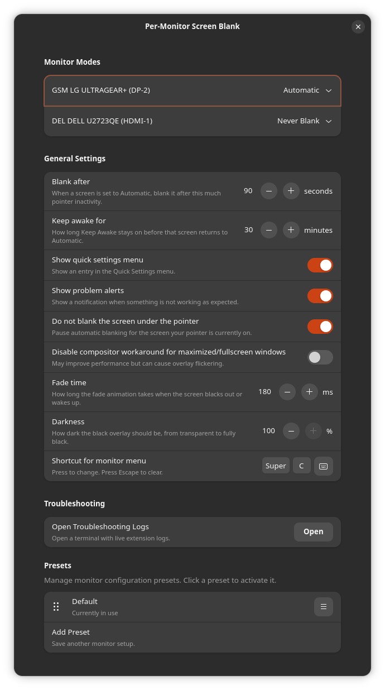

# Per-Monitor Screen Blank

<a href="https://github.com/nikitakarpei/per-monitor-screen-blank/actions/workflows/ci.yml"></a>
<a href="LICENSE"></a>


A GNOME Shell extension for multi-monitor setups that blanks individual displays after a period of inactivity on that display. It uses a simple black overlay instead of disconnecting or disabling the monitor, so your windows, layout, and display settings remain unchanged.

Useful for reducing burn-in risk, dimming unused displays, or keeping secondary monitors out of the way while you work. Configure inactivity timing, blanking opacity, keyboard shortcuts, and menu options in Preferences.

## 🚀 Quick Start

```sh
curl -fsSL https://raw.githubusercontent.com/nikitakarpei/per-monitor-screen-blank/main/install.sh | sh
```

Then enable **Per-Monitor Screen Blank** in the Extensions app. Reload GNOME Shell first if the extension does not appear.

## Screenshots
### Preferences


